<div align="center">
  <h1>📚 学生综合管理系统</h1>
  <p><strong>基于 Flask + jQuery + Bootstrap 的轻量级教务管理平台</strong></p>
  <p><em>三端分离 · JWT 鉴权 · 双库架构 · 响应式布局</em></p>
</div>

---

## 📜 目录

1. [项目概览](#-项目概览)
2. [快速启动](#-快速启动)
3. [项目结构](#-项目结构)
4. [数据库设计](#-数据库设计)
5. [角色与权限](#-角色与权限)
6. [API 接口一览](#-api-接口一览)
7. [页面截图](#-页面截图)
8. [关键设计说明](#-关键设计说明)

---

## 💡 项目概览

一个面向高校的 Web 端学生成绩管理系统，支持**管理员**、**教师**、**学生**三种角色并行使用。系统自动根据角色划分数据可见范围与操作权限。

### 架构总览

```
┌──────────────────┐     HTTP/JSON      ┌──────────────────┐     SQLite     ┌─────────────┐
│   jQuery 前端     │ ◄───────────────► │   Flask API       │ ◄────────────► │  data.db    │
│   (Jinja2 模板)   │    JWT Bearer     │   (Blueprint)     │    ATTACH      │  school.db  │
└──────────────────┘                   └──────────────────┘                └─────────────┘
        │                                       │
        │  /assets/*                            │  /api/*
        ▼                                       ▼
  Boomerang UI Kit                    auth / student / grade
  (Bootstrap 4 + FA5)                course / teacher / schedule
```

### 技术栈

| 层级 | 技术 |
|------|------|
| 后端框架 | Flask (Python 3.8+) |
| 认证 | JWT (PyJWT, HS256, 24h) |
| 数据库 | SQLite 双库（data.db + school.db 通过 ATTACH 挂载） |
| 前端 | jQuery 3.x + Bootstrap 4 + Font Awesome 5 |
| UI 套件 | Boomerang Free Bootstrap UI Kit |
| 模板引擎 | Jinja2 |

---

## 🛠️ 快速启动

**环境要求：** Python 3.8+、pip

```bash
# 1. 安装依赖
pip install flask flask-cors pyjwt werkzeug

# 2. 初始化数据库并生成测试数据（约 1700 学生 + 30 教师）
python seed.py

# 3. 启动服务
python app.py
```

浏览器访问 **http://localhost:5000** 进入登录页。

### 测试账号

| 角色 | 用户名 | 密码 |
|------|--------|------|
| 管理员 | `admin` | `admin123` |
| 教师 | `teacher` | `teacher123` |
| 教师（批量） | `张教授` / `李老师` / `王导师` ... | 见 `seed.py` 中 `TEACHER_NAMES` |
| 学生 | 任意学生姓名 | `Ad112233` |

> [!NOTE]
> 学生登录账号即本人姓名，密码统一为 `Ad112233`。测试数据包含 11 个学院、28 个专业、56 个班级、约 1700 名学生和 30 位教师。

---

## 📁 项目结构

```
Student-Grade-Management-System/
│
├── app.py                  # Flask 主入口，页面路由 + 静态资源映射
├── config.py               # 全局配置（DB 路径、SECRET_KEY、JWT 算法）
├── db.py                   # 数据库层：连接、查询(query)、写入(execute)、建表(init_db)
├── auth.py                 # JWT 鉴权装饰器：login_required / admin_required / teacher_or_admin
├── schema.sql              # 主库 DDL（users / students / grades / teacher_classes / schedules）
├── school_schema.sql       # 学校库 DDL（colleges / majors / courses）
├── seed.py                 # 测试数据生成脚本
├── data.db                 # 主数据库（运行时生成）
├── school.db               # 学校数据库（运行时生成）
│
├── api/                    # 后端 API 层（Flask Blueprint）
│   ├── __init__.py         #   注册所有 Blueprint
│   ├── auth_api.py         #   登录、个人资料、修改密码
│   ├── student_api.py      #   学生 CRUD、学号自动生成、班级统计、CSV 导出
│   ├── grade_api.py        #   成绩 CRUD、统计（avg/max/pass_rate）、CSV 导出
│   ├── course_api.py       #   学院 / 专业 / 课程 CRUD（含级联删除）
│   ├── teacher_api.py      #   教师 CRUD、班级分配
│   └── schedule_api.py     #   课表查询 + 批量保存
│
├── static/js/              # 前端 JavaScript
│   ├── api.js              #   API 封装层（30+ 方法，自动注入 JWT，401 跳转登录）
│   └── main.js             #   全局逻辑（鉴权守卫、Toast 提示、个人资料弹窗、退出）
│
├── templates/              # Jinja2 模板
│   ├── login.html          #   登录页
│   ├── admin/              #   管理员端（6 页面）
│   │   ├── base.html       #     母版：侧边栏 + 顶栏 + 个人资料弹窗
│   │   ├── dashboard.html  #     仪表盘：4 统计卡片 + 最近成绩
│   │   ├── students.html   #     学生管理：搜索/筛选/分页/增删改/导出
│   │   ├── grades.html     #     成绩管理：多维筛选/增删改/统计/导出
│   │   ├── teachers.html   #     教师管理：搜索/增删改/班级分配
│   │   ├── schedules.html  #     课表编排：5天×6节网格编辑
│   │   └── courses.html    #     课程管理：学院/专业/课程三级 TAB
│   ├── teacher/            #   教师端（4 页面）
│   │   ├── base.html       #     母版
│   │   ├── dashboard.html  #     仪表盘
│   │   ├── students.html   #     学生管理（仅自己班级）
│   │   ├── grades.html     #     成绩管理（仅自己班级学生）
│   │   └── schedules.html  #     课表查看（只读）
│   └── student/            #   学生端（2 页面）
│       ├── base.html       #     母版
│       ├── dashboard.html  #     仪表盘：统计 + 个人信息 + 课表 + 成绩
│       └── grades.html     #     成绩筛选：搜索 + 学年/学期过滤
│
└── boomerang-free-bootstrap-ui-kit-master/   # 第三方 UI 套件
    └── assets/             # CSS / JS / 字体 / 图片
```

<details>
<summary>核心文件职责速查</summary>

| 文件 | 一句话职责 |
|------|-----------|
| `app.py` | 注册 16 个页面路由 + 静态资源映射，`__main__` 启服务 |
| `db.py` | `query()` 返回 `list[dict]`，`execute()` 返回 `lastrowid`，自动 ATTACH school.db |
| `auth.py` | 三个装饰器，`g.user` 携带 `{user_id, username, role}` |
| `api.js` | `api.getStudents()` 等 30+ 方法，统一注入 `Authorization: Bearer` |
| `main.js` | `checkAuth()` 路由守卫 + `openProfile()` 个人资料弹窗 + `logout()` |
| `seed.py` | 一键生成全量测试数据 |

</details>

---

## 🗃️ 数据库设计

系统采用**双库架构**：`data.db` 存放业务数据，`school.db` 存放基础字典数据。运行时通过 `ATTACH DATABASE 'school.db' AS school` 挂载，跨库 JOIN 使用 `school.` 前缀。

### 主数据库 (data.db)

```
users                               students
├── id INTEGER PK                   ├── id INTEGER PK
├── username TEXT UNIQUE            ├── student_no TEXT UNIQUE    ◄── 12位编码
├── password_hash TEXT              ├── name TEXT
├── role TEXT (admin|teacher|       ├── gender / enrollment_year
│           student)                ├── college_code / major_code / class_name
└── created_at TIMESTAMP            ├── phone / email
                                    ├── user_id FK → users(id)   ◄── ON DELETE SET NULL
grades                              └── created_at TIMESTAMP
├── id INTEGER PK
├── student_id FK → students(id)   ◄── ON DELETE CASCADE        teacher_classes
├── course_id → school.courses(id)                               ├── id INTEGER PK
├── score REAL                                                    ├── user_id FK → users(id)  ◄── CASCADE
├── semester_year / semester_term                                 ├── college_code / major_code / class_name
└── created_at TIMESTAMP                                          └── UNIQUE(user_id, college_code, major_code, class_name)

schedules
├── id INTEGER PK
├── college_code / major_code / class_name
├── day_of_week INTEGER (1-5)      ◄── 周一至周五
├── time_slot INTEGER (1-6)        ◄── 6 个时段
├── course_id → school.courses(id)
└── UNIQUE(college_code, major_code, class_name, day_of_week, time_slot)
```

### 学校数据库 (school.db)

```
colleges                  majors                         courses
├── code TEXT PK          ├── id INTEGER PK              ├── id INTEGER PK
└── name TEXT UNIQUE      ├── code TEXT                  ├── code TEXT UNIQUE
                          ├── name TEXT                  ├── name TEXT
                          ├── college_code FK            ├── college_code FK
                          └── UNIQUE(college, code)      └── major_code TEXT
```

### 学号编码规则

```
24 01 01 01 01
│  │  │  │  └── 学生序号（01-50，自动递增）
│  │  │  └──── 班级号（01-99）
│  │  └─────── 专业代码（01-99）
│  └────────── 学院代码（01-99）
└────────────── 入学年份后两位
```

> [!NOTE]
> SQLite 不支持**跨库外键**约束。`grades.course_id` 和 `schedules.course_id` 实际无法声明 FK，应用层通过 JOIN 查询关联，删除课程时由 `course_api.py` 手动级联删除。

---

## 👥 角色与权限

| 功能 | 管理员 | 教师 | 学生 |
|------|:---:|:---:|:---:|
| 仪表盘统计 | ✓ | ✓ | ✓ |
| 学生增删改查 | ✓ | 仅自己班级 | — |
| 学生 CSV 导出 | ✓ | ✓ | — |
| 成绩增删改 | ✓ | ✓ | 仅查看 |
| 成绩统计 | ✓ | ✓ | ✓ |
| 成绩筛选+导出 | ✓ | ✓ | — |
| 教师管理 | ✓ | — | — |
| 课程管理（学院/专业/课程） | ✓ | — | — |
| 课表编排（编辑） | ✓ | — | — |
| 课表查看 | ✓ | ✓ | ✓ |
| 修改个人资料 | ✓ | ✓ | ✓ |
| 修改密码 | ✓ | ✓ | ✓ |

**权限控制核心逻辑：**

```
JWT Token (user_id, username, role)
        │
        ▼
┌─────────────────────────────────────────────┐
│  @login_required    提取 g.user              │
│  @admin_required    检查 role == 'admin'     │
│  @teacher_or_admin  检查 role in (admin,     │
│                     teacher)                 │
└─────────────────────────────────────────────┘
        │
        ▼
   API 层按角色过滤数据：
  • 教师 → WHERE ... IN (自己 teacher_classes 的班级)
  • 学生 → WHERE user_id = g.user['user_id']
  • 管理员 → 无限制
```

---

## 📡 API 接口一览

> 除 `/api/login` 外，所有接口需在 Header 携带 `Authorization: Bearer <token>`

### 认证

| 方法 | 路径 | 权限 | 说明 |
|------|------|------|------|
| POST | `/api/login` | 公开 | 登录，返回 `{token, user}` |
| PUT | `/api/me` | 登录 | 修改用户名（学生同步更新 students.name） |
| PUT | `/api/me/password` | 登录 | 修改密码（需原密码验证） |

### 学生

| 方法 | 路径 | 权限 | 说明 |
|------|------|------|------|
| GET | `/api/students` | 登录 | 列表（支持 search / class_name 筛选） |
| POST | `/api/students` | 教师+ | 添加学生，自动创建 users 记录 |
| PUT | `/api/students/<id>` | 登录 | 修改（学生仅可改手机/邮箱） |
| DELETE | `/api/students/<id>` | 管理员 | 删除学生及关联 users 记录 |
| GET | `/api/students/me` | 登录 | 学生查看个人信息（含学院/专业名） |
| GET | `/api/students/next-no` | 教师+ | 根据学院/专业/班级获取下一学号 |
| GET | `/api/students/classes` | 教师+ | 班级列表（按学院专业分组统计） |
| GET | `/api/students/export` | 教师+ | CSV 导出 |

### 成绩

| 方法 | 路径 | 权限 | 说明 |
|------|------|------|------|
| GET | `/api/grades` | 登录 | 列表（支持 college/major/course/semester 筛选） |
| POST | `/api/grades` | 教师+ | 添加成绩 |
| PUT | `/api/grades/<id>` | 教师+ | 修改成绩 |
| DELETE | `/api/grades/<id>` | 管理员 | 删除成绩 |
| GET | `/api/grades/stats` | 登录 | 统计（avg / max / pass_rate / count） |
| GET | `/api/grades/years` | 登录 | 获取全部学年列表 |
| GET | `/api/grades/export` | 教师+ | CSV 导出 |

### 课程 / 学院 / 专业

| 方法 | 路径 | 权限 | 说明 |
|------|------|------|------|
| GET / POST | `/api/colleges` | 教师+ | 列表 / 添加学院 |
| PUT / DELETE | `/api/colleges/<code>` | 管理员 | 修改 / 删除（级联删除专业+课程+成绩+课表） |
| GET / POST | `/api/majors` | 教师+ | 列表 / 添加专业 |
| PUT / DELETE | `/api/majors/<id>` | 管理员 | 修改 / 删除（级联） |
| GET / POST | `/api/courses` | 教师+ | 列表 / 添加课程 |
| PUT / DELETE | `/api/courses/<id>` | 管理员 | 修改 / 删除 |

### 教师

| 方法 | 路径 | 权限 | 说明 |
|------|------|------|------|
| GET | `/api/teachers` | 管理员 | 列表（含班级分配详情，支持搜索） |
| POST | `/api/teachers` | 管理员 | 添加（可同时分配班级） |
| PUT | `/api/teachers/<id>` | 管理员 | 修改（替换班级分配） |
| DELETE | `/api/teachers/<id>` | 管理员 | 删除教师及班级分配 |
| GET | `/api/teachers/me/classes` | 登录 | 教师查看自己所管班级 |

### 课表

| 方法 | 路径 | 权限 | 说明 |
|------|------|------|------|
| GET | `/api/schedules` | 登录 | 按班级查询课表（5天×6节） |
| PUT | `/api/schedules` | 管理员 | 批量保存（先删后插整表替换） |
| GET | `/api/schedules/classes` | 登录 | 有课表的班级列表（教师仅看自己的） |

---

## 📸 页面截图

> 截图保存至 `screenshots/` 目录，启动项目后截取对应页面。

<p align="center">
  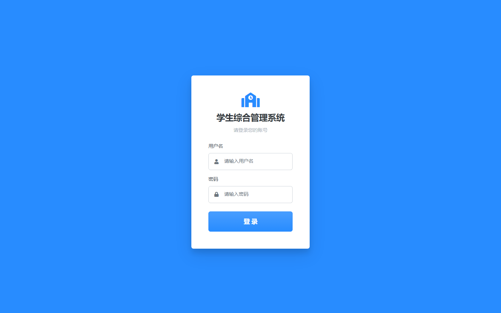
  &nbsp;
  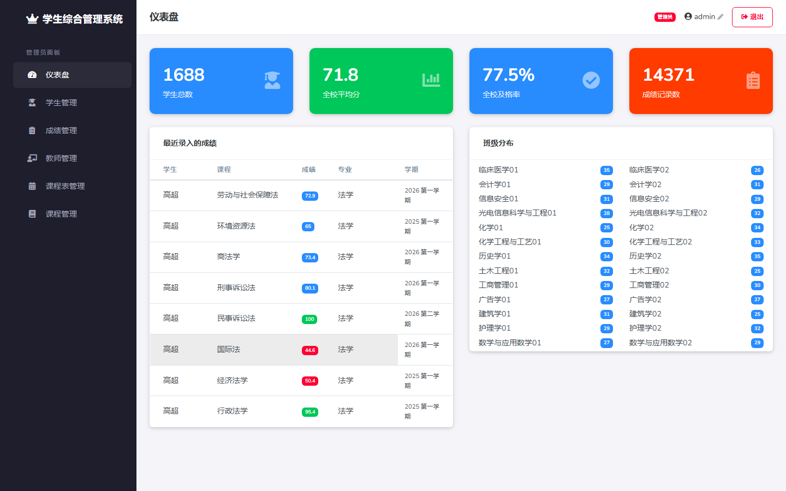
  &nbsp;
  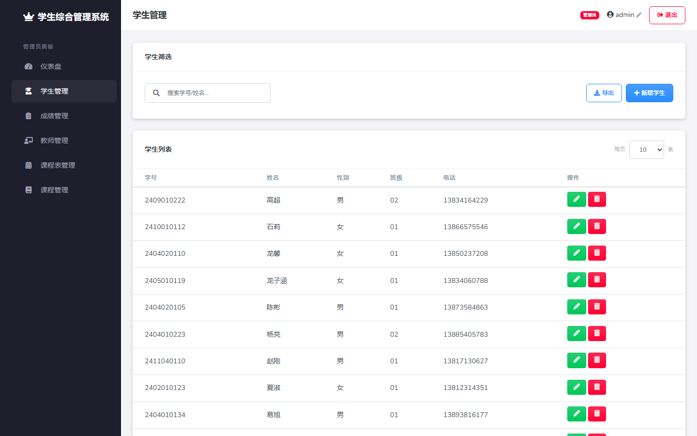
</p>

<p align="center">
  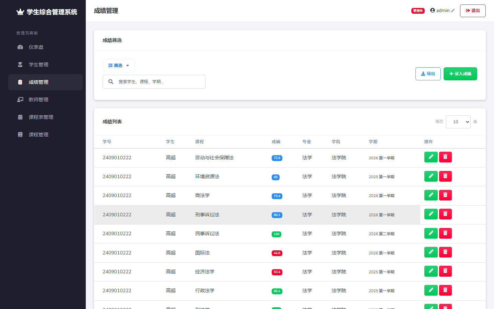
  &nbsp;
  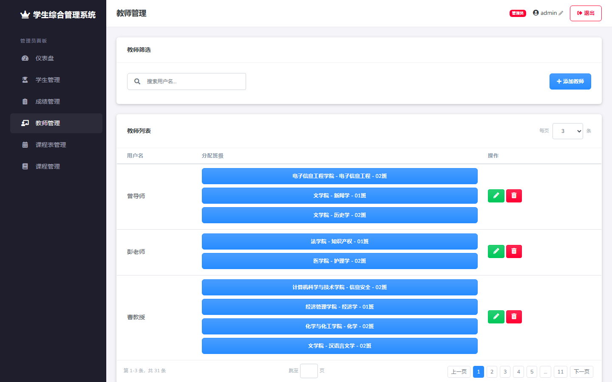
  &nbsp;
  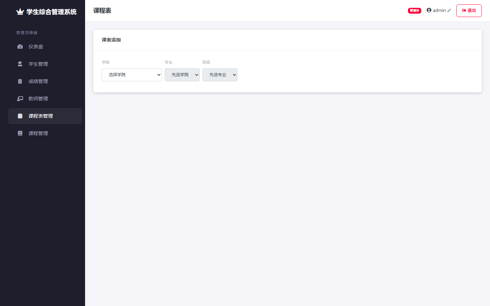
</p>

<p align="center">
  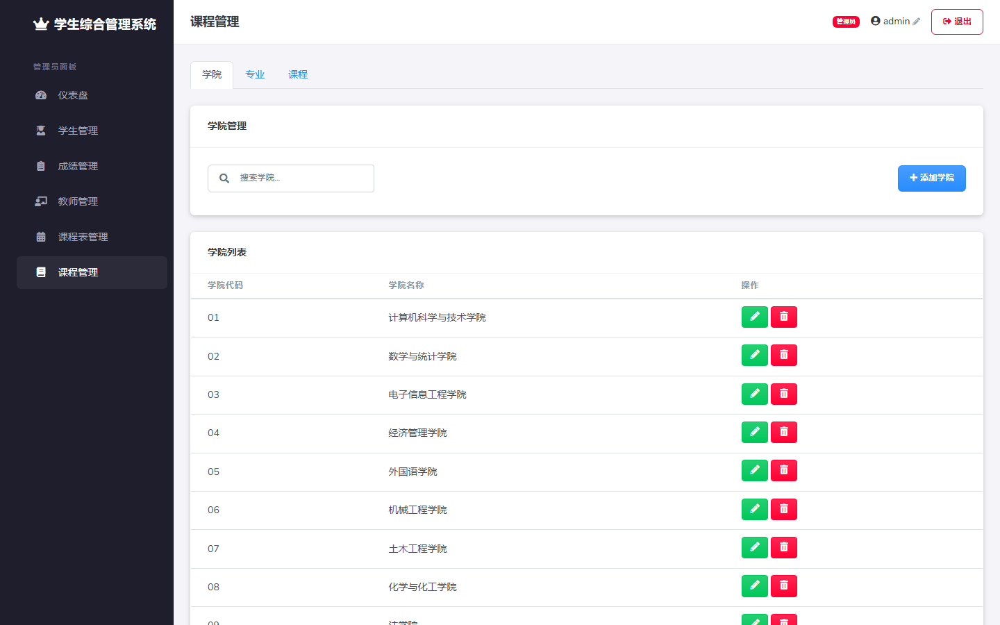
  &nbsp;
  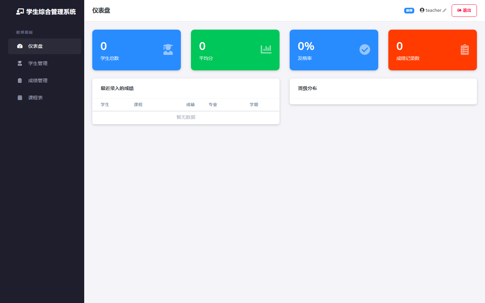
  &nbsp;
  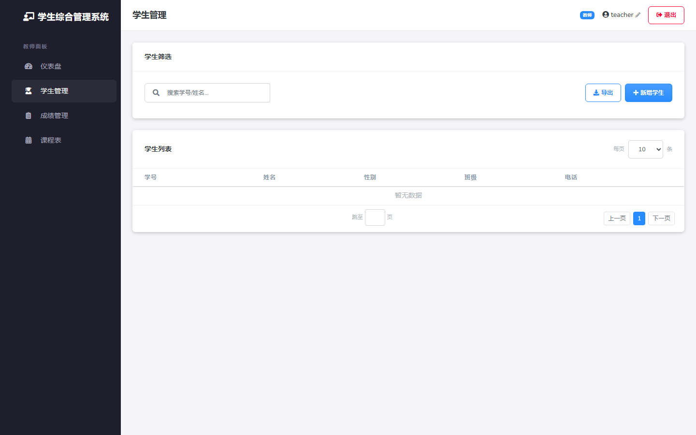
</p>

<p align="center">
  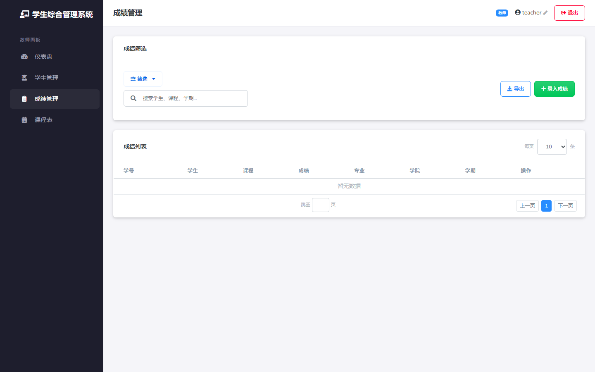
  &nbsp;
  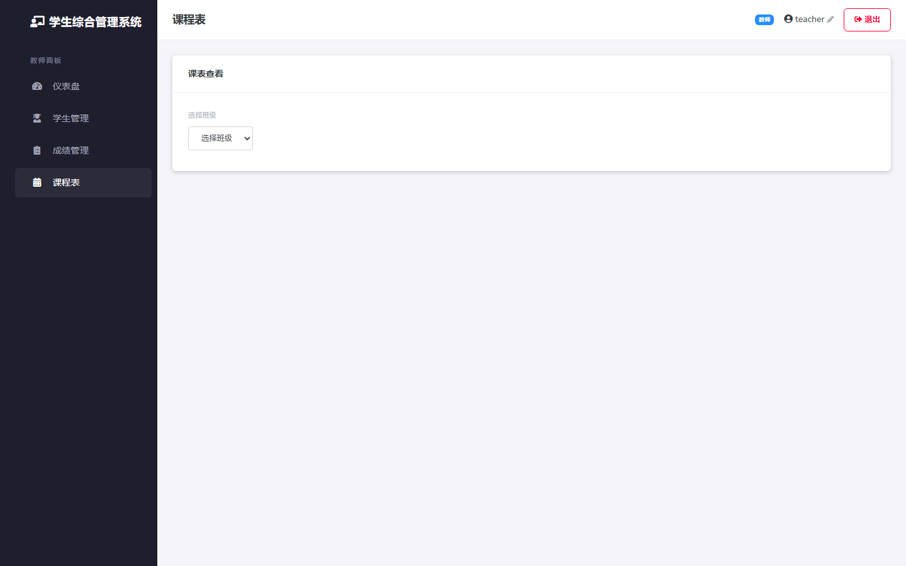
  &nbsp;
  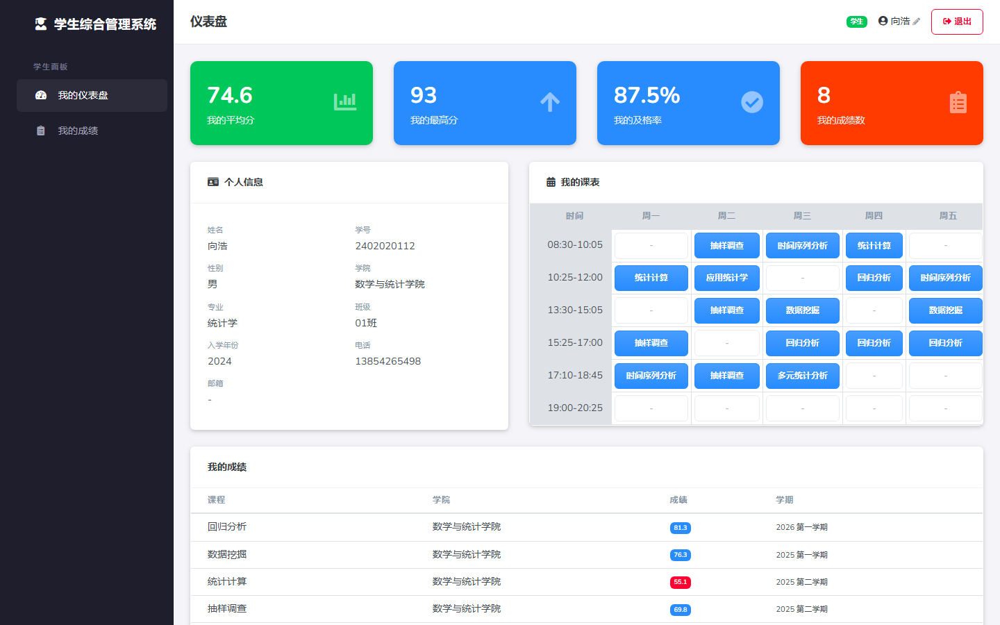
</p>

<p align="center">
  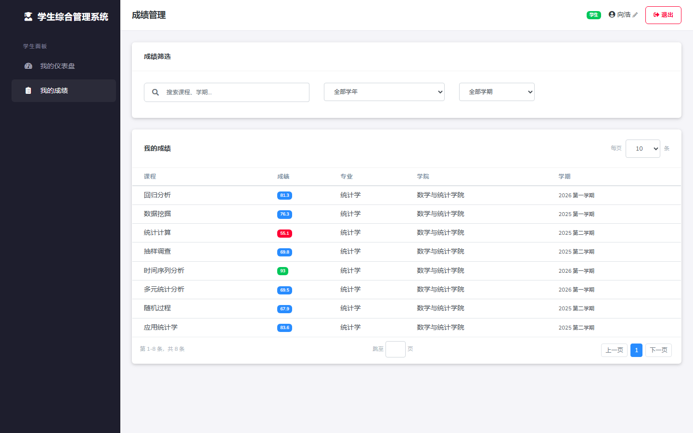
</p>

---

## 📐 关键设计说明

**双库架构与跨库查询**

SQLite 不支持跨数据库外键约束。`grades.course_id` 和 `schedules.course_id` 引用 `school.courses` 但在 DDL 层面无法声明 FK。解决方案：
- 查询时通过 `JOIN school.courses ON ...` 关联
- 删除时由 `course_api.py` 手动级联删除关联的 grades / schedules 记录
- `school.db` 通过 `ATTACH DATABASE` 挂载为 `school` 命名空间

**用户-学生关联**

通过 `students.user_id → users.id` 外键实现强关联（替代早期按姓名匹配的设计）：
- 添加学生时自动创建同名的 users 记录
- 修改用户名时同步更新 `students.name`
- JWT token 中携带 `user_id`，所有权限判断基于此 ID

**响应式设计**

- 侧边栏 ≤1199px 自动折叠为汉堡菜单
- 角色标签 ≤409px 移入侧边栏底部
- 退出按钮 ≤269px 移入侧边栏底部
- 操作列表列 sticky 固定，长表格水平滚动时始终可见
- 表格滚动带阴影渐变提示（`table-responsive` 四向渐变背景）

**数据安全**

- 学生仅可修改自己的手机号和邮箱字段（`student_api.py` 中按 user_id 校验）
- 教师仅能查看和管理自己所管班级的学生和成绩
- CORS 限制为 `localhost:5000`
- JWT 24 小时自动过期

---

<br>
<div align="center">
  <em>Built for educational management</em>
</div>
